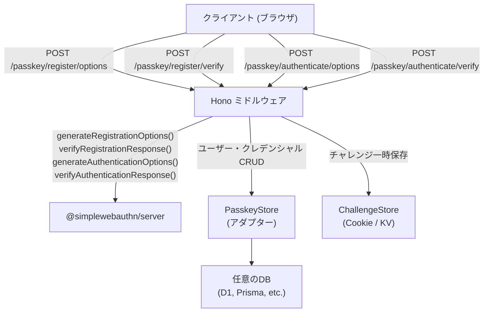

## はじめに

- [決定](#決定)
- [ステータス](#ステータス)
- [背景](#背景)
- [想定される影響](#想定される影響)
- [検討した他の選択肢](#検討した他の選択肢)
- [参考文献](#参考文献)
- [結果](#結果)

## 決定

Honoアプリケーションにパスキー（WebAuthn）認証機能を追加するミドルウェアを作成する。`@simplewebauthn/server` を利用し、登録・認証フローの4つのエンドポイントを自動的にマウントするファクトリ関数として実装する。

## ステータス

###  承認済み

## 背景

## User Review Required

> [!IMPORTANT]
> **パッケージの公開形態**: 現在のリポジトリ `hono-passkeys` のルート `package.json` にミドルウェア本体を配置し、`example/` はデモアプリとして残す想定です。npmパッケージとして公開する前提で `src/` 配下にソースを置きます。

> [!IMPORTANT]
> **ストレージの抽象化**: ユーザー情報やクレデンシャルの永続化はアダプターインターフェースで抽象化します。利用者が自分のDB（D1, Prisma, Drizzle等）を接続できるようにし、開発用にインメモリアダプターを提供します。

## Open Questions

> [!IMPORTANT]
> **セッション管理**: チャレンジの一時保存にはセッション（Cookie等）が必要です。`hono/cookie` を使ったシンプルな署名付きCookieベースのチャレンジ保存で良いですか？それとも外部セッションストア対応も必要ですか？

> [!IMPORTANT]
> **認証後の処理**: パスキー認証成功後のセッション発行方式について — JWT発行 or セッションCookie のどちらを想定しますか？ミドルウェアは認証成功を `c.set('passkeyUser', user)` でコンテキストにセットする形にし、セッション発行はユーザーに委ねる設計を提案します。

> [!NOTE]
> **ビルドツール**: TypeScriptのビルドには `tsup` を使い、ESM/CJSデュアルビルドを行う予定です。

## Proposed Changes

### ミドルウェアコア (`src/`)

#### [NEW] [types.ts](file:///home/user/Documents/GitHub/hono-passkeys/src/types.ts)

ミドルウェアの型定義:

```typescript
// Passkey クレデンシャル型
export type Passkey = {
  id: string;               // Base64URL encoded credential ID
  publicKey: Uint8Array;     // 公開鍵
  webAuthnUserID: string;    // WebAuthn ユーザーID
  counter: number;           // 署名カウンター
  deviceType: string;        // 'singleDevice' | 'multiDevice'
  backedUp: boolean;
  transports?: string[];
};

// ユーザー型
export type PasskeyUser = {
  id: string;
  username: string;
};

// ストレージアダプターインターフェース
export interface PasskeyStore {
  getUserByUsername(username: string): Promise<PasskeyUser | null>;
  createUser(user: PasskeyUser): Promise<void>;
  getPasskeysByUser(userId: string): Promise<Passkey[]>;
  getPasskeyById(credentialId: string): Promise<(Passkey & { userId: string }) | null>;
  savePasskey(userId: string, passkey: Passkey): Promise<void>;
  updatePasskeyCounter(credentialId: string, newCounter: number): Promise<void>;
}

// チャレンジストアインターフェース（一時的なチャレンジの保存）
export interface ChallengeStore {
  set(key: string, challenge: string, ttlMs?: number): Promise<void>;
  get(key: string): Promise<string | null>;
  delete(key: string): Promise<void>;
}

// ミドルウェア設定
export type PasskeyMiddlewareOptions = {
  rpName: string;           // Relying Party 名
  rpID: string;             // Relying Party ID (例: 'example.com')
  origin: string | string[];// 許可するオリジン
  store: PasskeyStore;      // クレデンシャルストア
  challengeStore?: ChallengeStore; // チャレンジストア（デフォルト: Cookie）
  pathPrefix?: string;      // APIパスのプレフィックス（デフォルト: '/passkey'）
};
```

#### [NEW] [index.ts](file:///home/user/Documents/GitHub/hono-passkeys/src/index.ts)

メインのミドルウェアファクトリ。以下の4エンドポイントを自動マウント:

| エンドポイント | メソッド | 説明 |
|---|---|---|
| `{prefix}/register/options` | POST | 登録オプション生成 |
| `{prefix}/register/verify` | POST | 登録レスポンス検証 |
| `{prefix}/authenticate/options` | POST | 認証オプション生成 |
| `{prefix}/authenticate/verify` | POST | 認証レスポンス検証 |

```typescript
import { Hono } from 'hono';
import {
  generateRegistrationOptions,
  verifyRegistrationResponse,
  generateAuthenticationOptions,
  verifyAuthenticationResponse,
} from '@simplewebauthn/server';
import type { PasskeyMiddlewareOptions } from './types';

export function passkey(options: PasskeyMiddlewareOptions) {
  const app = new Hono();
  const prefix = options.pathPrefix ?? '/passkey';

  // POST {prefix}/register/options
  app.post(`${prefix}/register/options`, async (c) => {
    // username をリクエストボディから取得
    // generateRegistrationOptions() でオプション生成
    // チャレンジを保存
    // オプションをJSONで返す
  });

  // POST {prefix}/register/verify
  app.post(`${prefix}/register/verify`, async (c) => {
    // verifyRegistrationResponse() で検証
    // 成功したらクレデンシャルをストアに保存
  });

  // POST {prefix}/authenticate/options
  app.post(`${prefix}/authenticate/options`, async (c) => {
    // generateAuthenticationOptions() でオプション生成
    // チャレンジを保存
  });

  // POST {prefix}/authenticate/verify
  app.post(`${prefix}/authenticate/verify`, async (c) => {
    // verifyAuthenticationResponse() で検証
    // 成功したらカウンター更新
    // ユーザー情報を返す
  });

  return app;
}
```

#### [NEW] [challenge.ts](file:///home/user/Documents/GitHub/hono-passkeys/src/challenge.ts)

Cookie ベースのデフォルトチャレンジストア実装。署名付きCookieでチャレンジを一時保存する。

#### [NEW] [store.ts](file:///home/user/Documents/GitHub/hono-passkeys/src/store.ts)

開発・テスト用のインメモリストア実装:

```typescript
export class InMemoryPasskeyStore implements PasskeyStore {
  private users = new Map<string, PasskeyUser>();
  private passkeys = new Map<string, Passkey & { userId: string }>();
  // ...
}

export class InMemoryChallengeStore implements ChallengeStore {
  private challenges = new Map<string, { value: string; expiresAt: number }>();
  // ...
}
```

---

### プロジェクト設定

#### [MODIFY] [package.json](file:///home/user/Documents/GitHub/hono-passkeys/package.json)

- `name` を `hono-passkeys` に変更
- `type: "module"` 追加
- `exports` フィールドでESM/CJSエントリポイント設定
- dependencies: `@simplewebauthn/server`, `hono`
- devDependencies: `tsup`, `typescript`, `vitest`, `@simplewebauthn/types`

#### [NEW] [tsconfig.json](file:///home/user/Documents/GitHub/hono-passkeys/tsconfig.json)

TypeScript設定。`target: "ES2022"`, `module: "ESNext"`, strict mode。

#### [NEW] [tsup.config.ts](file:///home/user/Documents/GitHub/hono-passkeys/tsup.config.ts)

ビルド設定。ESM/CJSデュアル出力。

---

### テスト

#### [NEW] [src/index.test.ts](file:///home/user/Documents/GitHub/hono-passkeys/src/index.test.ts)

Vitestを使ったユニットテスト:
- 登録フローのE2Eテスト（オプション生成 → 検証）
- 認証フローのE2Eテスト（オプション生成 → 検証）
- エラーケースのテスト（無効なチャレンジ、存在しないユーザー等）
- インメモリストアのテスト

---

### アーキテクチャ概要



## Verification Plan

### Automated Tests
```bash
pnpm vitest run
```

- InMemoryStore を使った登録→認証のフルフローテスト
- SimpleWebAuthn のモックを使った各エンドポイントのテスト
- エッジケース（重複登録、不正チャレンジ等）のテスト

### Manual Verification
- `example/` ディレクトリのTanStack Startアプリからミドルウェアを呼び出し、ブラウザでパスキー登録・認証が動作することを確認（別途対応）

## 想定される影響

<!-- この変更によって、何が簡単になり、何が難しくなるか？ -->

## 検討した他の選択肢

<!-- 後から他の選択肢を考慮したか、気にする必要がないように書いておく -->

## 参考文献

## 結果

<!-- この変更によって、もたらされた結果を後で書き込む -->


